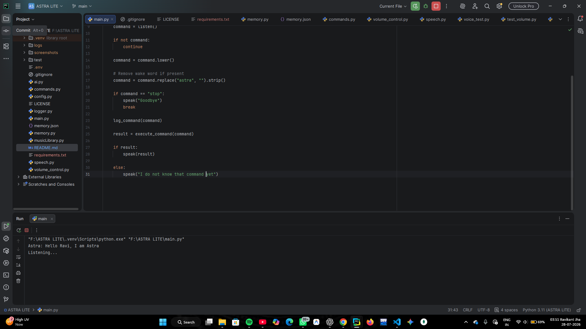

# ASTRA – AI Desktop Assistant

<p align="center">
  <strong>An AI-powered desktop assistant built with Python that automates everyday computer tasks using voice commands.</strong>
</p>

---

## Features

- 🎤 Voice-controlled desktop assistant
- 🗣️ Speech Recognition
- 🔊 Text-to-Speech responses
- 💻 Desktop application launcher
- 🌐 Website automation
- 🎵 YouTube song playback
- 🔉 System volume control
- 📸 Screenshot capture
- 💾 Persistent memory
- ⚡ System control (Shutdown, Restart, Lock, Sleep)
- 📝 Command logging
- 🤖 AI-ready modular architecture

---

# Screenshots

## Home Screen



---

## Desktop Application Launcher


---

## Website Automation


---

## YouTube Song Playback


---

## System Volume Control


---

## Project Structure


---

# Technologies Used

- Python 3.11
- SpeechRecognition
- pyttsx3
- PyAutoGUI
- PyCAW
- PyWhatKit
- pygame
- gTTS
- Python Dotenv

---

# Project Structure

```text
ASTRA/
│
├── main.py
├── commands.py
├── speech.py
├── logger.py
├── memory.py
├── volume_control.py
├── musicLibrary.py
├── ai.py
├── config.py
│
├── screenshots/
├── test/
│
├── README.md
├── LICENSE
├── requirements.txt
└── .gitignore
```

---

# Installation

Clone the repository

```bash
git clone https://github.com/YOUR_USERNAME/astra-ai-desktop-assistant.git
```

Move into the project

```bash
cd astra-ai-desktop-assistant
```

Install dependencies

```bash
pip install -r requirements.txt
```

Run ASTRA

```bash
python main.py
```

---

# Example Voice Commands

### Applications

- Open VS Code
- Open Calculator

### Websites

- Open YouTube
- Open Netflix
- Open Flipkart

### Entertainment

- Play Believer
- Play Faded

### System

- Set volume to 40
- Increase volume
- Mute volume
- Take screenshot
- Shutdown computer
- Restart computer
- Lock computer

### Utilities

- What is the time?
- What is today's date?

---

# Future Roadmap

- Google Gemini Integration
- Natural Language Understanding
- Offline Intent Matching
- AI Tool Calling
- Smart Conversation Memory
- Cross-platform Support
- GUI Dashboard

---

# License

This project is licensed under the MIT License.

---

# Author

**Ravikant Jha**

MCA Student | Python Developer | Aspiring Generative AI Engineer

If you found this project interesting, consider giving it a ⭐ on GitHub.